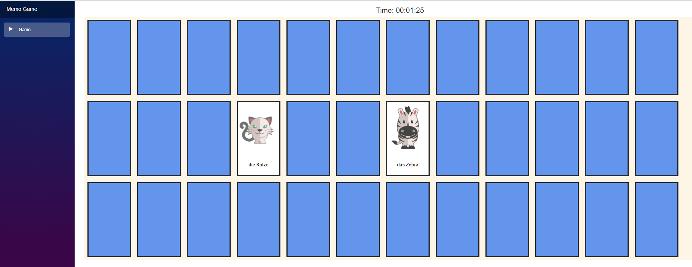

# MemoGameBlazor
Implementation of the board game Memo (german for kids) with Blazor (client-side). 

Game modes:

- Single Player
- Player vs Player (in the same browser window) 

This is just a learning project :)

